# Board graph

Generated by `boardkit render`; do not edit by hand.
Status-colored dependency graph. Solid arrows: depends.
Dotted links: serialize-with (never both in progress).

```mermaid
flowchart TD
  classDef backlog fill:#e2e8f0,color:#1a202c;
  classDef ready fill:#bee3f8,color:#1a202c;
  classDef inprogress fill:#fbd38d,color:#1a202c;
  classDef inreview fill:#d6bcfa,color:#1a202c;
  classDef done fill:#c6f6d5,color:#1a202c;
  subgraph epic_S41["epic: S41"]
    S41["S41 Co-worker consumption readiness"]:::backlog
    S8["S8 Board-root portability and checko…"]:::ready
    S12["S12 Public-repo seam for contract doc…"]:::ready
    S15["S15 Restore the human review guide to…"]:::done
    S30["S30 Wave-2 small-fix batch with the i…"]:::done
    S31["S31 Versioned docking-convention spec…"]:::done
    S32["S32 ArtifactStore ADR - receipts, pos…"]:::backlog
    S33["S33 Receipts and sidecar implementati…"]:::backlog
    S36["S36 rust-holes adopts the docking con…"]:::backlog
    S37["S37 Recomputable freshness stamp on t…"]:::backlog
    S38["S38 Pick the board's visual home"]:::ready
    S39["S39 Machine-bootstrap recipe and acco…"]:::ready
    S40["S40 README developer path, canary bri…"]:::ready
  end
  S1["S1 Wave-close retro with snapshots a…"]:::ready
  S2["S2 Wire pre-vet, deferrals, and pack…"]:::ready
  S3["S3 claude-skills defect sweep from t…"]:::ready
  S4["S4 Declare the typed-holes skill can…"]:::ready
  S5["S5 Run the never-run Gate T on nativ…"]:::done
  S6["S6 Template baseline digest, templat…"]:::backlog
  S7["S7 Thin transport wrapper spike with…"]:::backlog
  S9["S9 Session-model classification and …"]:::ready
  S10["S10 Prose-reviewer bench over snapsho…"]:::ready
  S11["S11 Tier the vale prose gate by artif…"]:::done
  S13["S13 R5' .boardkit resolution with the…"]:::done
  S14["S14 Bound the adversarial review cycl…"]:::done
  S16["S16 Render each card's current gate p…"]:::done
  S17["S17 Satellite-repo convention - no ca…"]:::ready
  S18["S18 R4 boards registry - the manifest…"]:::done
  S19["S19 R1 lanes as first-class card data"]:::done
  S20["S20 R10 board charters with the bk do…"]:::done
  S21["S21 R3 qualified cross-board referenc…"]:::done
  S22["S22 R9 goal-directed dag queries with…"]:::done
  S23["S23 R2 epic cards and epic membership"]:::done
  S24["S24 R6/R7 doctor checks - host-repo h…"]:::done
  S25["S25 R8 fix - card titles truncated at…"]:::done
  S26["S26 rust-holes HOLES ledger with a ho…"]:::ready
  S27["S27 Maintained architecture flowchart…"]:::backlog
  S28["S28 Wire the CLI core through the Car…"]:::inprogress
  S29["S29 Decide how strictly doctor should…"]:::done
  S34["S34 Decide whether the wave-level Gat…"]:::backlog
  S35["S35 Before/after canary extension for…"]:::backlog
  S42["S42 Fix doctor host checks that misfi…"]:::backlog
  S43["S43 Land the phase 2 residue - canary…"]:::done
  S44["S44 Consolidate the repeated path lit…"]:::backlog
  S1 -.- S6
  S1 -.- S9
  S2 --> S7
  S13 --> S18
  S18 --> S20
  S18 --> S21
  S13 --> S22
  S19 --> S22
  S28 --> S32
  S32 --> S33
  S32 --> S34
  S34 --> S35
  S31 --> S36
  S28 --> S37
  S16 --> S38
```

Goal-scoped wave plans: `boardkit dag --to <id> --render`.

